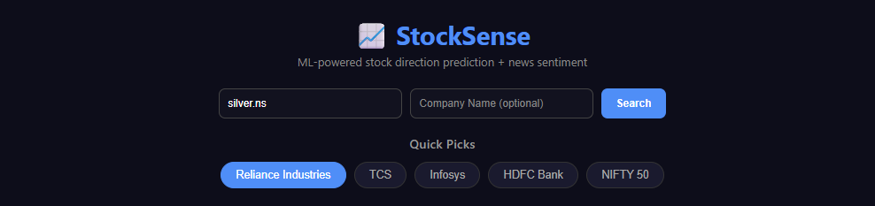
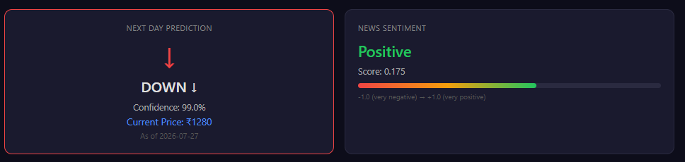
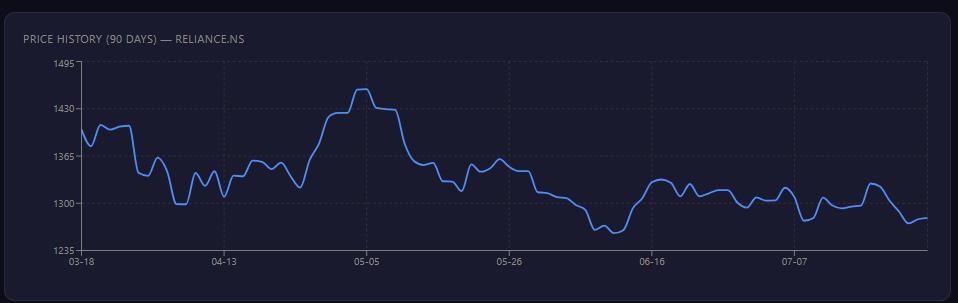
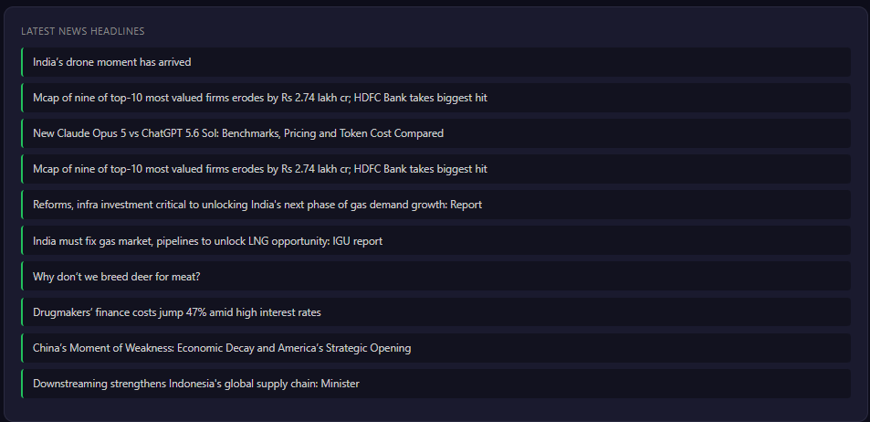

# 📈 StockSense

An end-to-end machine learning stock prediction dashboard that combines technical analysis with news sentiment.

## 🌐 Live Demo

Frontend:
https://YOUR-VERCEL-URL

Backend API:
https://stocksense-backend-production-9d86.up.railway.app

---

## Features

- 📈 Live stock & crypto search
- 🤖 ML prediction (UP / DOWN)
- 📊 Confidence score
- 😊 News sentiment analysis
- 📰 Latest news headlines
- 📉 90-day interactive price chart
- ⚡ FastAPI backend
- ⚛️ React frontend
- 🌙 Modern responsive UI

---

## Tech Stack

- React
- Axios
- Recharts
- FastAPI
- XGBoost
- VADER Sentiment
- Yahoo Finance
- NewsAPI

---

## Screenshots

### Home



### Prediction



### Chart



### Headlines



---

## Run Locally

```bash
npm install
npm start
```

Backend should be running at

```
http://localhost:8000
```

---

## Disclaimer

This project is for educational purposes only.

It should **not** be used for real financial trading.
